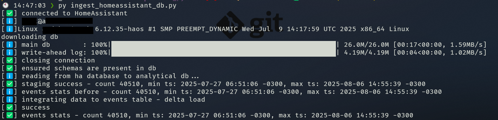

# Homedata

A **very** simple script that scrapes data from Home Assistant's [database](https://www.home-assistant.io/docs/backend/database/) (sqlite) to save events into an analytical database (duckdb).

The motivation for creating this was:

- by default, Home Assistant keeps only around 1 week of raw events data in the database
- extensions and add-ons that copy this data to more long term storage usually require some sort of database server (like the [Recorder](https://www.home-assistant.io/integrations/recorder/) integration)
- it seemed overkill to spin up an airflow container (at least 700MB size) just to copy a handful of data points from a transactional db to an analytical one

## Requirements

This script relies on downloading the HA database via SSH, with key pair authentication (so no saving passwords/credentials in the script). Use the config.toml file.

The repo uses [uv](https://github.com/astral-sh/uv) for managing the python virtual environment, and that includes [duckdb]()

## Usage

Copy the `config_sample.toml` to `config.toml` and fill in the required info for ssh connection.

Activate the python virtual environment (platform dependent), and run the ingest_homeassistant_db.py

You must run with the `--full_load` option the first time to create the tables properly. After that, only run a `full_load` if you intend to delete the data saved in the `events` table and re-load.  

```text
usage: ingest_homeassistant_db.py [-h] [-f | --full_load | --no-full_load] [-s | --skip_download | --no-skip_download]
                                  [-v | --verbose | --no-verbose] [--config_file CONFIG_FILE]

script that imports raw sensor data from homeassistant into a duckdb database

options:
  -h, --help            show this help message and exit
  -f, --full_load, --no-full_load
                        TRUNCATES the existing raw table and reloads from staging (will delete older data)
  -s, --skip_download, --no-skip_download
                        skips downloading file from ha server
  -v, --verbose, --no-verbose
                        should print output to stdout
  --config_file CONFIG_FILE
                        config file in TOML format
```



## Analytical db structure

```text
homedata (database)
├── staging (schema)
│   └── home_assistant_events (table)
├── raw_data (schema) 
│   └── events (table)
├── assets (schema - for future use)
└── analysis (schema - for future use)

```

## Running

It should be fine to run this script periodically, every few hours or even faster. Since it only copies the sqlite file from HA without opening the live remote file, impact into the running HA instance should be minimal. The script also copies the Write-Ahead-Log (wal) file, so it should bring a very up-to-date version of the db.
I plan on running it 3 or 4 times a day.

## Logging

Log file can be configured in the config.toml (LOG_FILE) and if you pass -v / --verbose option, the same messages will also be output to stdout.
